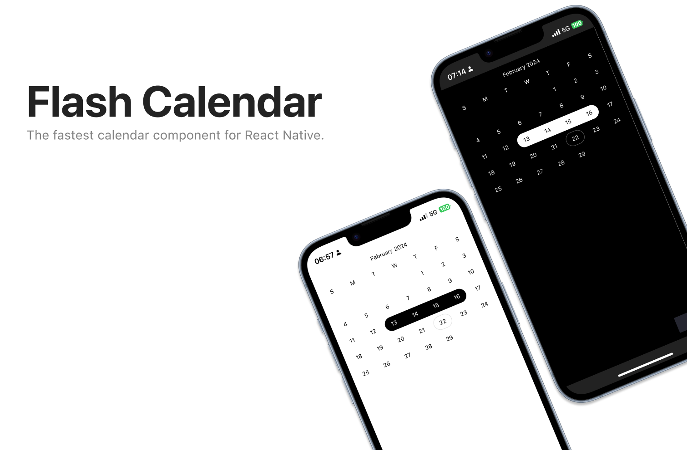

# React Native Flash Calendar

[](https://www.npmjs.com/package/@marceloterreiro/flash-calendar) [](https://www.npmjs.com/package/@marceloterreiro/flash-calendar) [](https://expo.io/)

This is the monorepo for Flash Calendar, an incredibly fast and flexible library to build calendars in React Native.



## Documentation & Examples

You can find the Flash Calendar documentation [on the website](https://marceloprado.github.io/flash-calendar/).

## Installation

This project uses [Bun](https://bun.sh/) as its package manager. The first thing you'll need is to [install Bun](https://bun.sh/).

To install dependencies, run at the root:

```bash
bun install
```

To build (required for a fresh install)

```bash
bun run build
```

To develop or run the example app:

```bash
bun dev
```

To run the documentation website:

```bash
bun docs
```

## Contributing

Ensure your changes are unit-tested. To improve DX, run the tests in watch mode with `bun test --watch`. You can also run the tests for a specific file with `bun test --watch {filename}`.

### Package structure

#### /apps

- `/apps/example`: Storybook host for Flash Calendar, runs with the latest uncompiled code.
- `/apps/docs`: The documentation website for Flash Calendar.

#### /kitchen-sink

A place to test the published Flash Calendar in a real environment.

- `/kitchen-sink/expo`: Scaffolded expo project to test the flash calendar in a real environment.

#### /packages

The actual src code for Flash Calendar:

- `/packages/flash-calendar`: The flash calendar package itself.
- `/packages/eslint-config`: Shared eslint config for the project.
- `/packages/tsconfig`: Shared tsconfig for the project.


### License

Flash Calendar is [MIT licensed](./LICENSE).