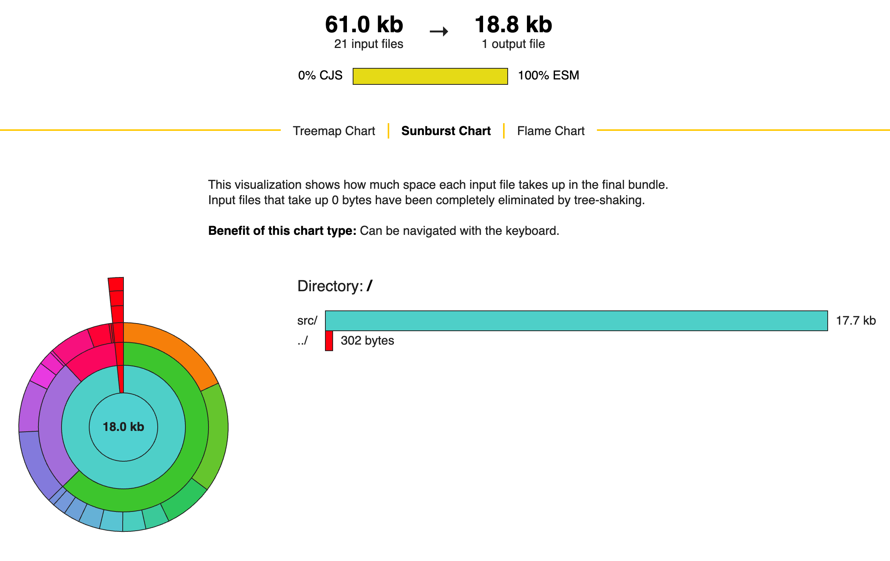

# Principles

Flash Calendar was initially built for [Moni](https://apps.apple.com/br/app/moni-finan%C3%A7as-pessoais/id6462422147), the product I work on during my free time. I saw a need for a fast and easy-to-customize package that allowed me to build high-quality and polished date pickers.

The existing solutions at that time didn't cover my needs. The most popular one, [`react-native-calendars`](https://github.com/wix/react-native-calendars) by Wix, was bloated and filled with polish issues (e.g. months with 6 and 5 weeks had incosistent spacing between each other). After mantaining a patch for that library for more than 3 years, I decided to do things differently this time and build my own solution.

I choose the following principles to guide API decisions and come up with an alternative I was happy with:

## Solve fewer needs better

After working with `react-native-calendars`, I realized that library tried to do too many things at once. Flash Calendar goes the opposite way. It offers an elegant way of building calendars and calendars lists. It doesn't neither plan to support other features like an agenda mode.

## Fast

Flash Calendar, as the name implies, works at lightening speeds for the use cases it was built for:

- infinite lists
- date picker
- date range picker

As such, it's heavily optimized to avoid unnecessary re-renders:

Notice from the video above, how only the dates affected by the range actually re-render. This means your calendar list stays responsive no matter how lengthy it is.

It also honors this principle for local development. Developing and writing tests for Flash Calendar should be so fast it makes you smile - in fact, this was the key reason [Bun](https://bun.sh/) was chosen as its test runner and [Turbo](https://turbo.build/) as its monorepo tool.

## Tiny footprint

I work for a large company. I know we're not willing to substantially increase our bundle-size. In fact, we seize every oppotunity to decrease it.

Besides, all companies already have their preferred date formatting library. Companies use `moment`, `date-fns`, `luxon`, `dayjs` and others. Flash Calendar shouldn't make an assumption about a particular library - this would add unnecessary bloat. It allows consumers to **bring their own date formatting library**, fully customizing how the dates are displayed and localized.

As a result, the library weights just 18.8kb in size (**6kb gzip**), with a [single 200 bytes](https://github.com/developit/mitt) external dependency:

## It's easy to do the right thing

## It's easy to eject it
